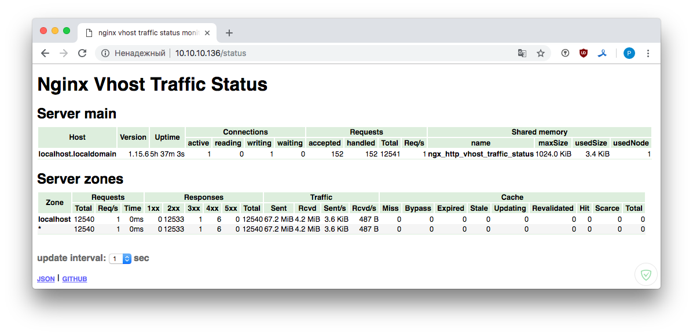

## Управление пакетами. Дистрибьюция софта. 

#### 1. Создать свой RPM пакет

Будем собирать nginx-1.15.6 из mainline ветки, с библиотекой openssl-1.1.1a и модулем статистики nginx-module-vts-0.1.18.

Все необходимые инструменты для сборки пакетов поставились при создании VM - см. [Vagrantfile](https://github.com/kakoka/otus-homework/blob/master/hw08/Vagrantfile).

В рекомендациях по сборке пакетов говорится, что сборка пакетов из-под `root` крайне опасная операция. Поэтому заведем пользователся `builder` из-под которого и будем собирать наш пакет.

```
$ sudo useradd builder && passwd builder
$ sudo usermod -a -G builder builder
$ su -u builder
```

Создадим иерархию каталогов для сборки: 

```
$ rpmdev-setuptree
$ tree
<pre>
`-- rpmbuild
    |-- BUILD
    |-- RPMS
    |-- SOURCES
    |-- SPECS
    `-- SRPMS
</pre>
```

Добавим удаленный репозиторий nginx, в котором есть исходники текущей версии [см. документацию](http://nginx.org/en/linux_packages.html#mainline): 

```
$ sudo vi /etc/yum.repos.d/nginx.repo
```
<pre>
[nginx]
name=nginx repo
baseurl=http://nginx.org/packages/mainline/centos/7/$basearch/
gpgcheck=0
enabled=1

[nginx-source]
name=nginx source repo
baseurl=http://nginx.org/packages/mainline/centos/7/SRPMS/
gpgcheck=0
enabled=1
</pre>

И скачаем последнюю версию исходников, после соберем все зависимости, необходимые для сборки nginx:

```
$ yumdownloader --source nginx
$ sudo yum-builddep nginx
```

Распакуем пакет с исходниками:

```
$ rpm -Uvh nginx-1.15.6-1.el7_4.ngx.src.rpm
```

Нам нужны исходники:

* nginx-module-vts-0.1.18
* openssl-OpenSSL_1_1_1a

Скачаем их и положим в папку `SOURCES`:

```bash
$ cd ~rpmbuild/SOURCES
wget https://github.com/openssl/openssl/archive/OpenSSL_1_1_1a.tar.gz
wget https://github.com/vozlt/nginx-module-vts/archive/v0.1.18.tar.gz
```

Далее нам необходимо внести изменения в файл nginx.spec, а именно:
Укажем источники исходников для библиотеки и модуля, куда положить распакованные исходники, и с какими опциями собрать nginx.
<pre>
Source14: OpenSSL_1_1_1a.tar.gz
Source15: v0.1.18.tar.gz
...
%setup -T -D -a 14
%setup -T -D -a 15
...
--with-openssl=%{_builddir}/%{name}-%{version}/openssl-OpenSSL_1_1_1a \
--add-module=%{_builddir}/%{name}-%{version}/nginx-module-vts-0.1.18
</pre>

```bash
$ rpmbuild -ba ~/rpmbuild/SPECS/nginx.spec
```

Собрался пакет:

<pre>
$ ll ~/rpmbuild/RPMS/x86_64/
total 6736
-rw-rw-r--. 1 builder builder 3934760 Nov 21 17:49 nginx-1.15.6-1.el7_4.ngx.x86_64.rpm
-rw-rw-r--. 1 builder builder 2960524 Nov 21 17:49 nginx-debuginfo-1.15.6-1.el7_4.ngx.x86_64.rpm
</pre>

Опции:

* %setup - распаковывает исходники библиотеки и модуля внуть папки первого Source [то есть сначала распаковывается архив с исходниками nginx, внутрь него распаковывается следующий, указанный], опция `-a #` указывает к какому Source мы применили это правило установки.
* [Вот тут подробнее обо всех опциях] (http://wiki.rosalab.ru/ru/index.php/%D0%A1%D0%B1%D0%BE%D1%80%D0%BA%D0%B0_RPM_-_%D0%B1%D1%8B%D1%81%D1%82%D1%80%D1%8B%D0%B9_%D1%81%D1%82%D0%B0%D1%80%D1%82)
* [RPM команды, шпаргалка] (http://linux-notes.org/komanda-rpm-v-primerah)

#### 2. Создать репозиторий и разместить RPM пакет

Создадим директорию для размещения репозитария и поместим туда наш пакет.

```
$ mkdir -p /opt/repo && mkdir -p /opt/repo/{RPMS,SRPMS} && mkdir -p /opt/repo/RPMS/x86_64  
cp nginx-1.15.6-1.el7_4.ngx.* /opt/repo/RPMS/x86_64
```

Создадим репозиторий:

```
createrepo -v /opt/repo/
```

Добавим `/etc/yum.repos.d/vts.repo`.

<pre>
[vts]
name=local vts repo 
baseurl=file:///opt/repo
gpgcheck=0
enabled=1
priority=1
</pre>

Проверим:

```
$ yum repo-pkgs vts list
```

<pre>
Loaded plugins: fastestmirror
Loading mirror speeds from cached hostfile
 * base: dedic.sh
 * extras: mirror.tversu.ru
 * updates: dedic.sh
Available Packages
nginx.x86_64             1:1.15.6-1.el7_4.ngx     vts
nginx-debuginfo.x86_64   1:1.15.6-1.el7_4.ngx     vts
</pre>


Добавим в `/etc/nginx/conf.d/default.conf`

```
location /repo {
  autoindex on;
  root /opt;
  }
```

и в `/etc/yum.repos.d/vts.repo `


Поставим наш пакетик, проверим его работоспособность.

rpm -i nginx-1.15.6-1.el7_4.ngx.x86_64.rpm

Добавим в `/etc/nginx/nginx.conf` – `http { vhost_traffic_status_zone; }`, а в `/etc/nginx/conf.d/default.conf`:

<pre>
location /status {
  vhost_traffic_status_display;
  vhost_traffic_status_display_format html;
}
</pre>


