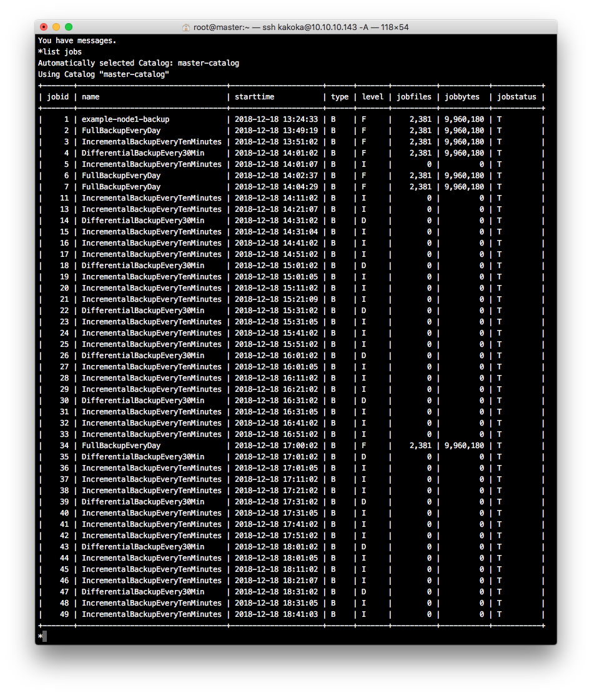
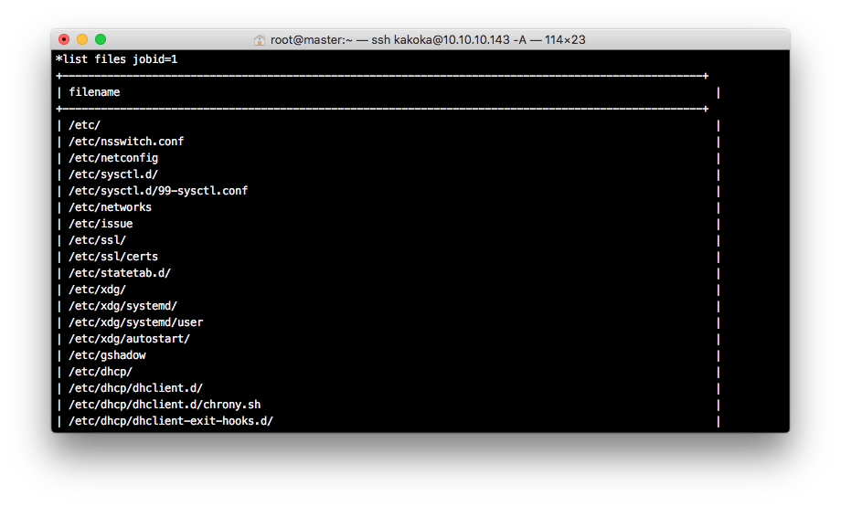

## Bacula 

#### 0. Ansible роль

Написаны роли для развертывания [postgres11](roles/_add_pgsql11), [bacula-director, bacula-storage, bacula-console](roles/add_bacula), для развертывания на клиенте [bacula-file-daemon](roles/add_bacula_client).

Некторые нюансы установки и запуска bacula заключаются в дополнительно настройке подсистемы SELinux. Необходимо добавить политики, иначе director и storage не запустятся, или будут работать некорректно.

Подробнее об этом тут - [Bacula and SELinux](http://sysadm.mielnet.pl/bacula-and-selinux-denying-access/).

Проверим логи аудита, посмотрим куда не пускают 'bacula-director'. 

```
type=AVC msg=audit(1545335462.553:58336): avc:  denied  { getattr } for  pid=4878 comm="bacula-dir" path="/proc/sys/net/ipv6/conf/all/disable_ipv6" dev="proc" ino=286662 scontext=system_u:system_r:bacula_t:s0 tcontext=system_u:object_r:sysctl_net_t:s0 tclass=file
```

Cоздадим разрешающие правила политики SELinux из файлов журналов, содержащих сообщения о запрете операций:

```
$ ausearch -c 'bacula-dir' --raw | audit2allow -M my-baculadir
$ semodule -i my-baculadir.pp
```

Проверим сопоставление контекстов файлов и пользователей.

```
$ semanage fcontext -l | grep bacula
...
/var/bacula(/.*)? all files system_u:object_r:bacula_store_t:s0
...
```

Установим контекст для `bacula_store_t`, что бы bacula-storage мог работать с каталогом /opt/backups.

```
chcon system_u:object_r:bacula_store_t:s0 /opt/backup
semanage fcontext -a -t bacula_store_t "/opt/backup(/.*)?"
restorecon -R -v /tank/backup
```

Добавим все вышеописанное в роль для развертывания bacula на сервере.

#### 1. Настроить политику бэкапа директории /etc с клиента:

Настройка осуществляется путем создания в конфигурационном файле Director `/etc/bacula-dir.conf` секций Job, Schedule, Pool и FileSet и организации взаимосвязи между ними.

##### 1.1 Полный бэкап раз в день
```
Schedule {
  Name = "EveryDay"
  Run = Level=Full daily at 17:00
}
```
```
Job {
   Name = "FullBackupEveryDay"
   Type = Backup
   Level = Full
   ...
   }
```
##### 1.2 Инкрементальный каждые 10 минут

```
Schedule {
  Name = "EveryTenMinutes"
  Run = Level=Incremental hourly at 0:01
  Run = Level=Incremental hourly at 0:11
  Run = Level=Incremental hourly at 0:21
  Run = Level=Incremental hourly at 0:31
  Run = Level=Incremental hourly at 0:41
  Run = Level=Incremental hourly at 0:51
  }
```
```
Job {
    Name = "IncrementalBackupEveryTenMinutes"
    Type = Backup
    Level = Incremental
    ...
    }
```
##### 1.3 Дифференциальный - каждые 30 минут

```
Schedule {
  Name = "DiffEvery30Minutes"
  Run = Level=Differential hourly at 0:01
  Run = Level=Differential hourly at 0:31
  }
```
```
Job {
   Name = "DifferentialBackupEvery30Min"
   Type = Backup
   Level = Differential
   ...
	}
```

##### 1.4 list jobs, list files jobid=`<id>`, конфиги bacula-*




[Файлы конфигурации](roles/add_bacula/templates/bacula-dir.conf.j2) bacula.

##### TODO. 

Можно написать отдельную роль только для конфигурации расписания запуска нужных типов бэкапа, где шаблонизировать конфигурационный файл `bacula-dir.conf`


#### 2. Настроить сжатие, шифрование, дедупликацию

##### 2.1 Компрессия

Компрессия настраивается через добавление в секцию FileSet директивы `compression = GZIP`.

```
FileSet {
 Name = "master-set"
   Include {
     Options {
        signature = MD5
        compression = GZIP
        recurse = yes
        }
      }
    }
```

##### 2.2 Шифрование

Для настройки шифрования воспользуемся официальным руководством на bacula.org - [Data Encryption](http://www.bacula.org/5.2.x-manuals/en/main/main/Data_Encryption.html).

Делается эта процедура на стороне клиента, происходит генерацию ключей и сертификатов, которые используются в шифровании и дешифровании файлов. Через механизмы Ansible генерируются необходимые сертификаты, но что-то в них нет так, поэтому в [роли для развертывания клиентов](roles/add_bacula_client/tasks/main.yml) используется "ручной привод" - `shell`. Сгенерированные согласно доументации ключи добавляются в конфигурационный файл `/etc/bacula/bacula-fd.conf`:

```
 PKI Signatures = Yes
 PKI Encryption = Yes
 PKI Keypair = "/etc/bacula/node.pem"
 PKI Master Key = "/etc/bacula/master.crt"
```

##### 2.3 Дедупликация

Идея дедупликации в bacula: сначала создается базовый тип резервной копии, а последующие копии строятся от этой базвой, таким образом исключая неизмененные файлы. Документация - [File Deduplication using Base Jobs](http://www.bacula.org/9.4.x-manuals/en/main/File_Deduplication_using_Ba.html). Директивы: `Accurate = yes`, `Spool Attributes = yes`.

Пример: Base_Backup <- New_Base_Backup

```
Job 
{ 
  Name = Base_Backup
  Level = Base
  ...
}
```

```
Job {
  Name = New_Base_Backup
  Base = Base_Backup
  ...
  Accurate = yes
  Spool Attributes = yes
}
```

В `bconsole` сначала запустим пункт 5, потом будем запускать только пункт 6.

```    
The defined Job resources are:
  ...
  5: Base-Backup-node1
  6: New-Base-Backup-node1
```


На скриншоте указано стрелками что у нас создался зашифрованная резервная копия с дедупликацией  ¯\_(ツ)_/¯.

Умные люди призыват использовать для бэкапа файловые системы с поддержкой дедупликации -
[Block-level File-system Deduplication with Aligned Volumes](http://bacula.us/block-level-deduplication-with-aligned-volumes-tutorial-bacula-7-9-9-0-and-above/)

