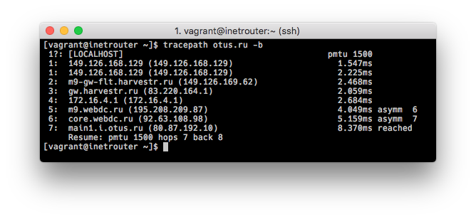
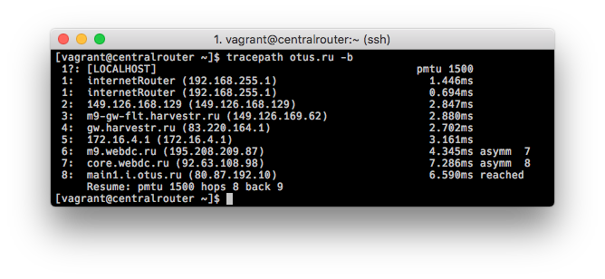
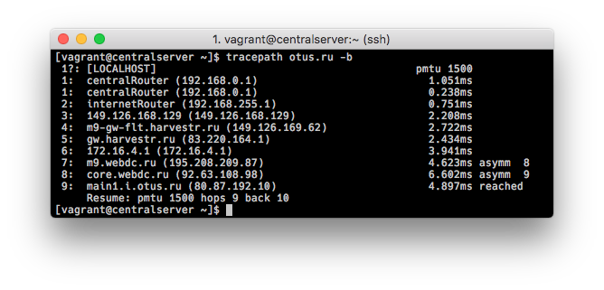
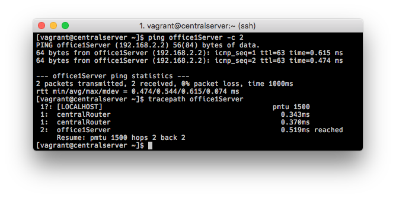
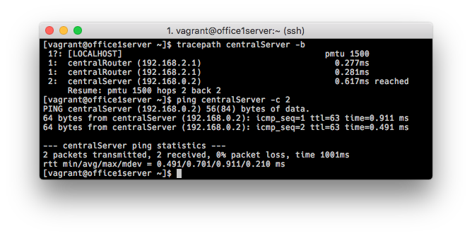
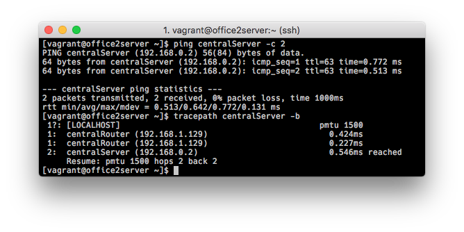
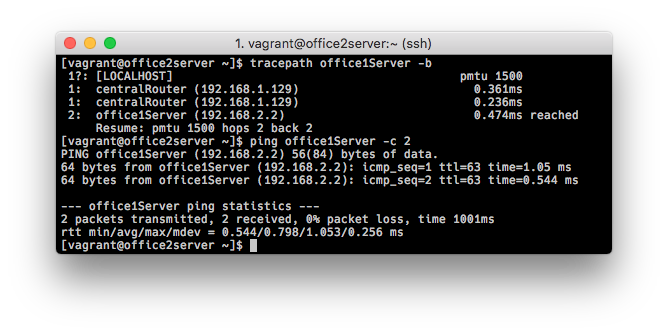

## Архитектура сетей

### 1. Теоретическая часть

#### 1.1 Найти свободные подсети.

|Подсеть|Min IP|Max IP|Broadcast|Hosts|Mask|
|---|---|---|---|:---:|---|
|192.168.0.16/28|192.168.0.17|192.168.0.30|192.168.0.31|14|255.255.255.240|
|192.168.0.48/28|192.168.0.49|192.168.0.62|192.168.0.63|14|255.255.255.240|
|192.168.0.128/25|192.168.0.129|192.168.0.254|192.168.0.254|126|255.255.255.128|

#### 1.2 Посчитать сколько узлов в каждой подсети, включая свободные.

##### Office1

|Название|Подсеть|Broadcast|Hosts|Mask|
|---|---|---|:---:|---|
|dev|192.168.2.0/26|192.168.2.63|62|255.255.255.192|
|test servers|192.168.2.64/26|192.168.2.127|62|255.255.255.192|
|managers|192.168.2.128/26|192.168.2.191|62|255.255.255.192|
|office hardware|192.168.2.192/26|192.168.2.255|62|255.255.255.192|

##### Office2

|Название|Подсеть|Broadcast|Hosts|Mask|
|---|---|---|:---:|---|
|dev|192.168.1.0/25|192.168.1.127|126|255.255.255.128|
|test servers|192.168.1.128/26|192.168.1.191|62|255.255.255.192|
|office hardware|192.168.1.192/26|192.168.1.255|62|255.255.255.192|


##### Central

|Название|Подсеть|Broadcast|Hosts|Mask|
|---|---|---|:---:|---|
|directors|192.168.0.0/28|192.168.0.15|14|255.255.255.240|
|office hardware|192.168.0.32/28|192.168.0.47|14|255.255.255.240|
|wifi|192.168.0.64/26|192.168.0.127|62|255.255.255.192|


#### 1.3 Указать broadcast адрес для каждой подсети.

Broadcast адреса указаны в таблицах выше. Ошибки при разбиении не обнаружил.

### 2. Практическая часть

Немного расширим исходную схему:

```sequence
  Office1 → office2-net ⤵
(4 subnets)  (switch)     CentralRouter → router-net → InternetRouter ⇨ internet
                                 ↑         (switch)
  Office2 → office2-net ⤴  central-net  
(3 subnets)  (switch)        (switch)    
                                 ↑
                           CentralOffice
                            (3 subnets)
```


#### 2.1 Соединить офисы в сеть согласно схеме и настроить роутинг.

##### 2.1.1 Internet Router

InetRouter - внешний интерфейс (eth0) получает ip-адрес по DHCP, на внутренний интерфейс (eth1) назначаем ip-адрес 192.168.255.1/255.255.255.252. Включаем NAT на eth0 и создаем статический маршрут: 

```
iptables -t nat -A POSTROUTING ! -d 192.168.0.0/16 -o eth0 -j MASQUERADE
ip route add 192.168.0.0/16 via 192.168.255.2
```

Так же в `/etc/sysctl.conf` добавляем опции ядра, которые разрешают нам форвардинг пакетов:

```
echo "net.ipv4.ip_forward=1" >> /etc/sysctl.conf
sysctl -p /etc/sysctl.conf
```

##### 2.1.2 Виртуальные сети (switches)

Создадим виртуальные свитчи:

- router-net - к нему подключены внутренний интерфейс inetRouter (eth1) и внешний интерфейс centralRouter (eth1)
- central-net - к нему подключена сеть центрального офиса
- office1-net - к нему подключена сеть офиса 1
- office2-net - к нему подключена сеть офиса 2

##### 2.1.3 Сentral Router

На centralRouter создаем 4 сетевых интерфейса и назначим им ip-адреса:

- eth1 - 192.168.255.2/255.255.255.252, подключен к router-net
- eth2 - 192.168.0.1/255.255.255.240, подключен к central-net
- eth3 - 192.168.1.1/255.255.255.128, подключен к office2-net
- eth4 - 192.168.2.1/255.255.255.192, подключен к office1-net

Так же на centralRouter на интерфейсы eth2,3,4 добавим дополнительные ip-адреса:

Подсети центрального офиса:
- eth2:0 192.168.0.33/255.255.255.240
- eth2:1 192.168.0.65/255.255.255.192

Подсети офиса 1:
- eth3:0 192.168.2.65/255.255.255.192
- eth3:1 192.168.2.129/255.255.255.192
- eth3:2 192.168.2.193/255.255.255.192

Подсети офиса 2:
- eth4:0 192.168.1.129/255.255.255.192
- eth4:1 192.168.1.193/255.255.255.192

и добавляем в sysctl.conf опции для форвардинга пакетов.

#### 2.2 Все сервера и роутеры должны ходить в интернет через inetRouter.

Проверяем, ходят ли все сервера и роутеры в интернет - `tracepath otus.ru -b`:

- internetRouter ⇨ internet



- centralRouter ⇨ internetRouter ⇨ internet



- centralServer ⇨ centralRouter ⇨ internetRouter ⇨ internet



- office1Server ⇨ centralRouter ⇨ internetRouter ⇨ internet


- office2Server ⇨ centralRouter ⇨ internetRouter ⇨ internet


#### 2.3 Все сервера должны видеть друг друга.

Проверяем видимость - `tracepath $servername -b` и `ping $servername -c 2`:

- centralServer ⇨ centralRouter ⇨ office1Server

- centralServer ⇨ centralRouter ⇨ office1Server

- office1Server ⇨ centralRouter ⇨ centralServer

- office1Server ⇨ centralRouter ⇨ office2Server

- office2Server ⇨ centralRouter ⇨ centralServer

- office2Server ⇨ centralRouter ⇨ office1Server


#### 2.4 У всех серверов отключить дефолтный маршрут через eth0, который Vagrant поднимает для связи.

Отключаем дефолтный маршрут командной:

```
echo "DEFROUTE=no" >> /etc/sysconfig/network-scripts/ifcfg-eth0 
```

Добавляем необходимый нам gateway исходя из конфигурации наших сетей (например, office1Server):

```
echo "GATEWAY=192.168.2.1" >> /etc/sysconfig/network-scripts/ifcfg-eth1
```

Попутно, для удобства, внесем изменения в /etc/resolv.conf - добавим локальный DNS-сервер и в /etc/hosts внесем записи, в зависимости от сервера:

```
192.168.255.1 internetRouter
192.168.1.129 centralRouter
192.168.0.2 centralServer
192.168.2.2 office1Server
192.168.1.130 office2Server
```
Таблица маршрутов на centralRouter:


#### 2.5 При нехватке сетевых интерфейсов, добавить по несколько адресов на интерфейс.

Добавлены несколько сетевых адресов на интерфейс, см. в п. 2.1. Отметим, что более оптимальный способ организации такого рода сети - разбиение на VLANы. 

Все описанные выше настройки внесены в [Vagrantfile](Vagrantfile).
##### PS.

По какой-то неясной причине `systemctl restart network` не отрабатывает через provision в Vagrant. Это относится как к shell, так и ansible. Приходится заходить на каждую виртуалку и руками перезапускать network.