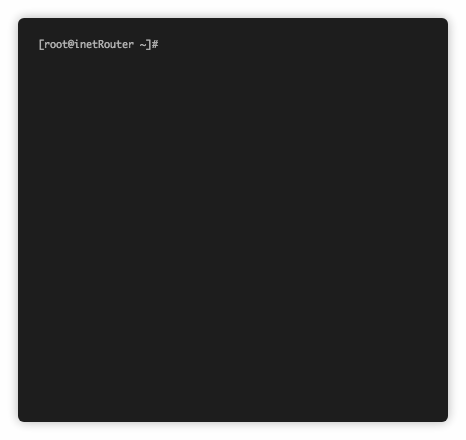
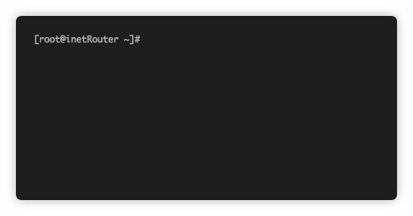

## VLAN. Bonding.

### 1.1 VLAN

Добавим в Vagrantfile конфигурацию виртуальных машин: testServer1, testServer2, testClient1, testClient2. Сделаем provision посредством shell в vagrant, добавим для каждой виртуальной машины по одному vlan-интерфейсу `eth1.x` через редактирование соответствующего файла настройки интерфейса `/etc/sysconfig/network-scripts/ifcfg-eth1.x`. Для testServer1, testClient1 - `eth1.1`, для testServer2, testClient2 - `eth1.2`. Для серверов ip адрес - 10.10.10.1, для клиентов 10.10.10.255.

Файл конфигурации VLAN-интерфейса будет следующего вида:

```
NM_CONTROLED=no
BOOTPROTO=static
VLAN=yes
ONBOOT=yes
IPADDR=10.10.10.x
NETMASK=255.255.255.0
DEVICE=eth1.x
```

Для тестов, необходимо зайти в каждую ВМ и сделать ping:

- testServer1 <-> testClient1
- testServer2 <-> testClient2

```
[root@testServer2 ~]# ping 10.10.10.254
PING 10.10.10.254 (10.10.10.254) 56(84) bytes of data.
64 bytes from 10.10.10.254: icmp_seq=1 ttl=64 time=0.724 ms
64 bytes from 10.10.10.254: icmp_seq=2 ttl=64 time=0.523 ms
64 bytes from 10.10.10.254: icmp_seq=3 ttl=64 time=0.434 ms
```

**PS.**
Что бы применились настройки сети через провижн, придется зайти через `vagrant ssh` после создания ВМ и сделать `sudo systemctl restart network`.

**PPS.**
Для того что бы попасть с `testClient1` на `testServer1` без пароля пользователю `vagrant`, нужно скопировать приватный ключ этого пользователя на `testClient1` командной `cp -a /vagrant/id_rsa /home/vagrant/.ssh/.` Делаем это через shell provision.

### 2. Bonding

Настриваем bond-интерфейс:

- на стороне inetRouter: `eth1`, `eth2`
- на стороне centralRouter: `eth2`, `eth5`

Настройка bond-интерфейса `ifcfg-bond0`:

```
NM_CONTROLED=no
DEVICE=bond0
ONBOOT=yes
TYPE=Bond
BONDING_MASTER=yes
IPADDR=192.168.255.1
PREFIX=30
BOOTPROTO=static
BONDING_OPTS="mode=1 miimon=100 fail_over_mac=1"
```

Настройка интерфейсов входящих в bond-интерфейс:

```
NM_CONTROLED=no
BOOTPROTO=none
ONBOOT=yes
DEVICE=eth1
MASTER=bond0
SLAVE=yes 
```

Тестируем интерфейс, сделаем две ssh-сессии, в одном терминале пишем:
`watch -n1 cat /proc/net/bond0`


в другом - `ifdown eth1 && ifup eth1`


Наблюдаем за работой bond-интерфейся в режиме active-active. `Currently active slave` меняется при отключении `eth1` на `eth2`, а при включении - обратно.