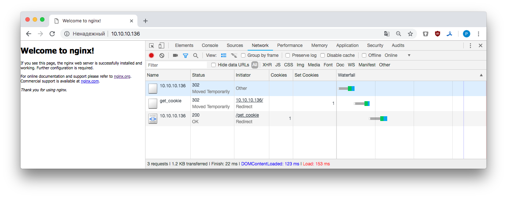

## Nginx

Написать конфигурацию nginx, которая даёт доступ клиенту только с определенной cookie. Если у клиента её нет, нужно выполнить редирект на location, в котором cookie будет добавлена, после чего клиент будет обратно отправлен (редирект) на запрашиваемый ресурс.

[Конфигурация](default.conf) сервера:

<pre>
server {
    listen       80;
    server_name  localhost;
    index index.html index.htm;
    root /usr/share/nginx/html;
    access_log  /var/log/nginx/host.access.log  main;

    location / {
      if (<b>$cookie_id != "123"</b>) {
         return 302 $scheme://$server_addr/get_cookie;
      }
    }
    location /get_cookie {
      <b>add_header Set-Cookie "id=123";</b>
      return 302 $scheme://$server_addr;
    }
}
</pre>

Если мы запрашиваем location "/" и у нас не стоит cookie `id=123` то происходит редирект на location "/get_cookie", где клиент получает cookie – `add_header Set-Cookie "id=123"`, после чего происходит редирект на location "/" и клиент получает тестовую  страницу nginx. Используем для этого `redirect` с кодом 302. 302-о перенаправление говорит о том, что нужно перейти по другому адресу.

Проверяем с помощью `curl`, полученная cookie выделена полужирным:

<pre>
$ curl -b none -L -I 10.10.10.136

HTTP/1.1 302 Moved Temporarily
Server: nginx/1.15.6
Date: Sun, 03 Feb 2019 11:47:58 GMT
Content-Type: text/html
Content-Length: 145
Connection: keep-alive
Location: http://10.10.10.136/get_cookie

HTTP/1.1 302 Moved Temporarily
Server: nginx/1.15.6
Date: Sun, 03 Feb 2019 11:47:58 GMT
Content-Type: text/html
Content-Length: 145
Connection: keep-alive
Location: http://10.10.10.136
Set-Cookie: <b>id=123</b>

HTTP/1.1 200 OK
Server: nginx/1.15.6
Date: Sun, 03 Feb 2019 11:47:58 GMT
Content-Type: text/html
Content-Length: 612
Last-Modified: Thu, 22 Nov 2018 08:09:08 GMT
Connection: keep-alive
ETag: "5bf66424-264"
Accept-Ranges: bytes
</pre>

Смотрим логи nginx:

`
$ tail -f /var/log/nginx/host.access.log
`
<pre>
172.16.1.10 - - [03/Feb/2019:11:49:19 +0000] <b>"HEAD / HTTP/1.1" 302</b> 0 "-" "curl/7.54.0" "-"
172.16.1.10 - - [03/Feb/2019:11:49:19 +0000] <b>"HEAD /get_cookie HTTP/1.1" 302</b> 0 "-" "curl/7.54.0" "-"
172.16.1.10 - - [03/Feb/2019:11:49:19 +0000] <b>"HEAD / HTTP/1.1" 200</b> 0 "-" "curl/7.54.0" "-"
</pre>

Видим, что клиент запросил `/`, сервер не нашел у клиента cookie `id=123`, перешел по `/get_cookie`, получил cookie `id=123`, далее клиент перешел по `/` и получил в ответ дефолтную страницу nginx.

Ну и традиционный скриншот для наглядности:
