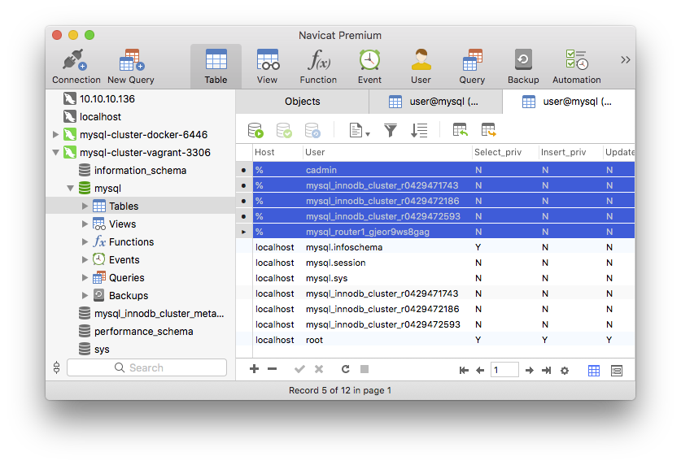
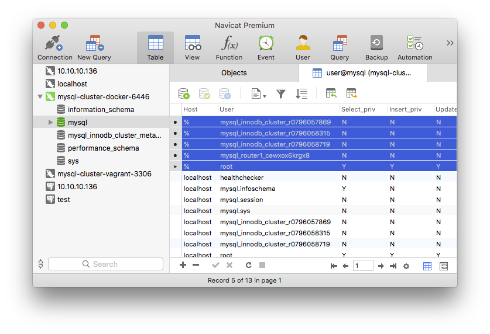
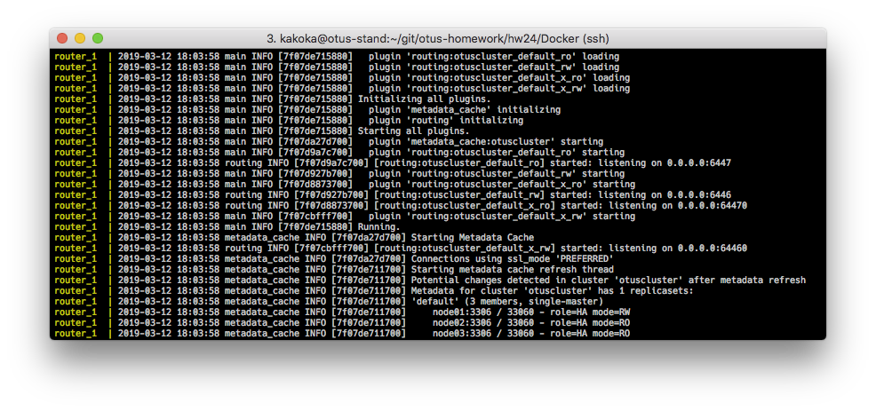

## MySQL InnoDB Cluster

Для создания InnoDB кластера соберем vagrant стенд:

- ns - dns сервер
- node01-node03 - ноды с установленным mysql server 8.0
- router - роутер

### 1. DNS

Адаптирована роль из домашней работы 21. [Файл](provisioning/dns-server.yml) включен в плейбук.

### 2. MySQL nodes

Разворачиваем роли с помощью [плейбука](provisioning/playbook.yml). Несколько нюансов:

- SELinux - необходимо выставить корректный мандат на сокет, используем policycoreutils-python для этого.
<pre>
grep mysqld /var/log/audit/audit.log | audit2allow -M mysqld
semodule -mysqld.pp
</pre>

Соответствующий [файл](provisioning/selinux.yml) включен в плейбук.

- Необходимо сменить пароль root пользователя, который необходимо найти в логе свежесозданного сервера mysql с помощью следующей конструкции: `"grep 'A temporary password is generated for root@localhost' {{ mysql_log_file }} | awk -F ' ' '{print $(NF)}'"`

- Необходимо проининициализировать инстанс mysql для работы в кластере. С помощью mysql shell:

`mysqlsh -- dba configure-instance \
{ --port=3306 --host=localhost --user=root --password={{ mysql_root_password }} } \
--clusterAdmin={{ mysql_cluster_admin_user }} \
--clusterAdminPassword={{ mysql_cluster_admin_password }} \
--restart=true \
--clearReadOnly=true \
--interactive=false`

### 3. MySQL shell

После установки нод и их инициализации, запускаем mysql shell в неинтерактивном режиме. Mysqlsh считывает скрипт `cluster-setup.js` (пример скрипта есть в официальной документации), в котором описаны директивы создания кластера:

<pre>
var dbPass = "passwd";
print(dbPass);
try {
   shell.connect('cadmin@node01:3306', dbPass);
   var cluster = dba.createCluster("otuscluster");
   cluster.addInstance({user: "cadmin", host: "node02", port: 3306, password: dbPass});
   cluster.addInstance({user: "cadmin", host: "node03", port: 3306, password: dbPass});
} catch(e) {
   print('\nThe InnoDB cluster could not be created.\n\nError: ' +
   + e.message + '\n');
}
</pre>

### 4. MySQL router

Последним запускается mysql-router:

<pre>
mysqlrouter --bootstrap '{{ mysql_cluster_admin_user }}:{{ mysql_cluster_admin_password }}'@node01 --user=mysqlrouter
</pre>

который считывает конфигурацию кластера и начинает управлять распределением запросов.

### 5. Использование

Любым клиентом (DBeaver, например) можно подключиться на localhost:3306 с парой логин/пароль `cadmin/convoy-Punk0` и получить доступ к кластеру.

Видим в выделении информацию о узлах кластера и пользователе. Здесь с кластером может работать специально заведенный для этого пользователь `cadmin`.

### 6. Docker

Тоже самое, но реализовано в [Docker](Docker/docker-compose.yml).

За основу взяты официальные образы mysql8-ce на dockerhub:

- https://hub.docker.com/_/mysql
- https://hub.docker.com/r/mysql/mysql-router

`
$ docker-compose up -d
`
Любым клиентом (DBeaver, например) можно подключиться на localhost:6446 с парой логин/пароль `root/swimming3` и получить доступ к кластеру.

Видим в выделении информацию о узлах кластера и пользователе. Здесь с кластером может работать пользователь `root`.

Есть нюанс - при старте контейнеров, нужно дождаться когда поднимутся все инстансы mysql, после чего их необходимо сконфигурировать для работы в кластере, далее создать кластер, после чего запустить mysql роутер. Все делается в автоматическом режиме, но не быстро, вероятно стоило пойти другим путем, сделать специальные образы (Dockerfile+build) и потом с помощью docker compose уже конструировать кластер.

### 7. Docker swarm

Написан [vagrantfile](Swarm/Vagrantfile) и [плейбук](Swarm/playbook.yml) для разворачивания docker swarm на нескольких виртуальных машинах (master, node01, node02).

Так же написан [mysql-cluster.yml](Swarm/swdocker/mysql-cluster.yml) для разворачивания сервисов - три mysql ноды и роутер.
После старта ВМ (`vagrant up` в каталоге `Swarm`) - `vagrant ssh master`, далее:

<pre>
$ cd /tmp
$ docker stack deploy --compose-file=port.yml portainer
$ docker stack deploy --compose-file=mysql-cluster.yml mc
</pre>

Можно сделать и автоматический старт кластера. Из недостатков - немного "костыльное" создание InnoDB кластера, но зато работает. Из нюансов, отметил бы работу DNS внутри swarm, нужно явно задавать `hostname` для контейнеров внутри кластера, иначе при инициализации InnoDB кластера, mysql не сможет найти ноды кластера по именам (имена хостов по умолчанию задаются уникальными идентификаторами).

Подключение к кластеру - любым клиентом на порт 3306, пара логин/пароль: `root/swimming3`.

### 8. Ссылки

- https://lefred.be/content/mysql-innodb-cluster-mysql-shell-starter-guide/
- https://www.soudegesu.com/en/mysql/mysql8-password/
- https://dev.mysql.com/doc/mysql-port-reference/en/mysql-ports-reference-tables.html
- https://linux.die.net/man/8/mysqld_selinux
- http://galeracluster.com/documentation-webpages/selinux.html
- https://relativkreativ.at/articles/how-to-compile-a-selinux-policy-package
- https://dev.mysql.com/doc/refman/8.0/en/mysql-innodb-cluster-working-with-cluster.html#use-mysql-shell-execute-script
- https://www.digitalocean.com/community/tutorials/how-to-configure-mysql-group-replication-on-ubuntu-16-04?comment=65995
- https://github.com/neumayer/mysql-docker-compose-examples/blob/master/innodb-cluster/docker-compose.yml
- https://github.com/rubberydub/mysql-innodb-cluster-docker-compose/blob/master/docker-compose.yml
- https://github.com/neumayer/docker-images/tree/master/mysql-shell-batch
