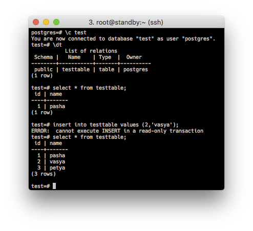
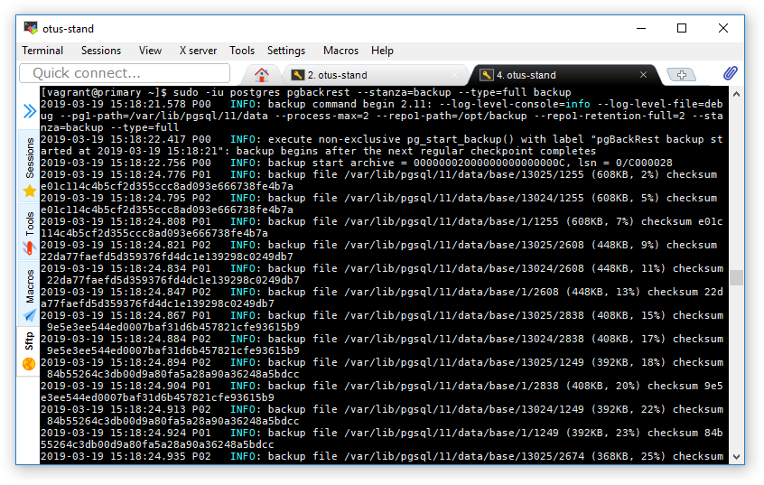
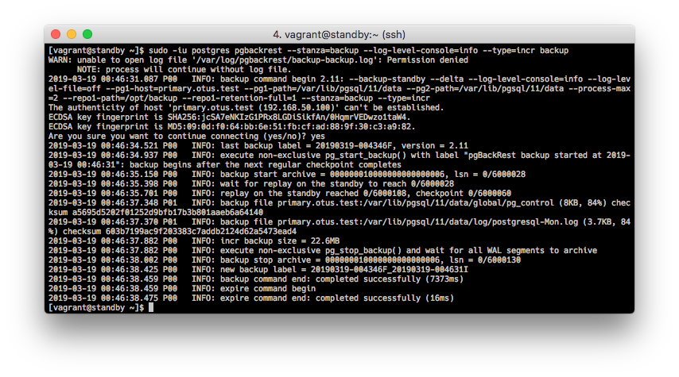

## PostgreSQL, репликация, резервное копирование.

Задача:

- настроить hot_standby репликацию с использованием слотов;
- Настроить правильное резервное копирование.

Описание стенда:

Развивая тему керберизованных сервисов, будем использовать стенд из [домашней работы 26](https://github.com/kakoka/otus-homework/tree/master/hw26). Развернем сервисы: DNS, NTP, Kerberos, NFS. После старта этих сервисов развернем PostgreSQL 11, настроим потоковую репликацию и резервное копирование. 

Две виртуальные машины:

- primary.otus.test - серверы DNS, NTP, Kerberos, NFS и PostgresSQL в режиме primary.
- standby.otus.test - PostgresSQL в режиме hot_standby.

Для резервного копирования будем использовать `pgbackrest`.

**Общая идея:**

Поскольку Postgres умеет авторизовать пользователей через керберос, используем это для настройки авторизации в Postgres. На primary.otus.test разворачиваем Postgres, настраиваем его в режиме primary, так же настраиваем потоковую репликацию с использованием слотов. 

На standby.otus.test разворачиваем Postgres в режиме `hot_standby`.

На обоих хостах установим `pgbackrest`, что бы была возможность инкрементального резервного копирования как с primary, так и со standby сервера. Для этого необходим общий репозиторий, который должен находиться на NFS ресурсе, для чего нужен работающий NFS сервер.

### 0. Подготовка

Развертывание сервисов NTP, DNS и NFS описана в [домашнем задании 26](https://github.com/kakoka/otus-homework/tree/master/hw26). Внесены небольшие поправки:

- записи A в файлах зон DNS сервера (primary, standby);
- standby синхронизируется primary по времени - изменение в конфиге chronyd;
- добавлены принципалы в базу данных Kerberos (postgres@OTUS.TEST, postgres/primary.otus.test@OTUS.TEST и тд.);
- экспортируется папка `/opt/backup` в настройках NFS сервра primary.otus.test;
- на standby.otus.test в `/opt/standby` монтируется папка с primary.otus.test;

Написаны [**ansible роли**](https://github.com/kakoka/otus-homework/tree/master/hw28/provision/roles) для всех компонентов стенда.

### 1. Репликация

#### 1. Настройка primary

После установки сервера, инициализации БД и старта сервера, заведем пользователя `replication` от имени которого будет выполянться репликация, установим пароль и ограничение на количество одновременных активных соединений:

```sql
$ sudo -iu postgres psql -c "CREATE USER replication REPLICATION LOGIN CONNECTION LIMIT 5 ENCRYPTED PASSWORD 'swimming3';"
```

##### 1.1 pg_hba.conf

Внесем следующие изменения:

<pre>
host replication replication primary.otus.test trust
host replication replication standby.otus.test trust
host all         all         192.168.50.0/24   gss map=mymap include_realm=0 krb_realm=OTUS.TEST
</pre>

Для доступа реплики к мастеру используем `trust`, для остальных пользователей из нашей подсети используем Kereberos авторизацию.

##### 1.2 postgres.conf

Внесем следующие изменения:

<pre>
# CONNECTIONS AND AUTHENTICATION
listener_address   = 192.168.50.100
krb_server_keyfile = '/usr/local/pgsql/etc/krb5.keytab'

# WRITE-AHEAD LOG
wal_level = hot_standby
synchronous_commit = local
archive_mode = on
archive_command = 'pgbackrest --stanza=backup archive-push %p' 

# REPLICATION - Sending Servers 
max_wal_senders = 2
wal_keep_segments = 10
max_replication_slots = 10
synchronous_standby_names = 'standby'
</pre>

##### 1.3 pg_ident.conf

Здесь мы определим варианты сопоставления пользователей, т.е. какой пользователь под каким именем может соединятся с БД. Документация [тут](https://postgrespro.ru/docs/postgresql/11/auth-username-maps).

<pre>
mymap portgres replication
mymap postgres postgres
mymap vagrant  postgres
</pre>

После всех изменений выполняем `systemctl restart postgresql-11`.

##### 1.4 pgbackrest.conf

Этот файл имеет отношения к резервному копированию. Нам необходимо инициализировать репозиторий с резервными копиями. Его основные параметры определяются в файле `/etc/pgbackrest.conf`.

<pre>
[global]
repo1-path=/opt/backup
repo1-retention-full=2
process-max=2
log-level-console=info
log-level-file=debug

[backup]
pg1-path=/var/lib/pgsql/11/data
</pre>

Выполняем команду, которая создаст репозиторий для бэкапа:

```bash
$ sudo -iu postgres pgbackrest --stanza=backup --log-level-console=info stanza-create
```

и сделаем первый бэкап:

```bash
pgbackrest --stanza=backup --log-level-console=info backup
```

#### 2. Настройка standby

Останавливаем постгрес, удаляем текущую `/var/lib/pgsql/11/data` из создаем ее снова, не забывая выставить нужные права.

Выполняем со `standby.otus.test` резервное копирование базы сервера `primary.otus.test` в директорию `/var/lib/pgsql/11/data`:

```bash
$ sudo -iu postgres kinit 
$ sudo -iu postgres pg_basebackup -h primary.otus.test \
  -U replication -D /var/lib/pgsql/11/data -P --wal-method=stream
```

Вносим правки в postgres.conf:

<pre>
listener_address = 192.168.50.101
hot_standby = on
</pre>

Добавляем recovery.conf:

<pre>
standby_mode = on
primary_conninfo = 'host=primary.otus.test port=5432 user=replication password=swimming3 application_name=standby'
restore_command = 'pgbackrest --stanza=backup archive-get %f "%p"'
trigger_file = '/tmp/postgresql.trigger.5432'
recovery_target_timeline = 'latest'
</pre>

И запускаем постгрес.

#### 3. Проверка работы репликации

**primary**

Вывод запросов к серверу о статусе репликации:

```bash
$ sudo -iu postgres psql -c "select application_name, state, sync_priority, sync_state from pg_stat_replication;"
$ sudo -iu postgres psql -x -c "select * from pg_stat_replication;"
```


Подключимся к базе данных:

```bash
$ sudo -iu postgres
$ psql
```

Создаем базу данных и подключимся к ней:

```sql
postgres=# create database test;
postgres=# \c test
```

Создадим таблицу testtable и добавим в нее данные:

```sql
test=# create table testtable( id serial primary_key, name varchar(50);
test=# insert into testtable values (1,'pasha');
test=# insert into testtable values (2,'vasya'),(3,'petya');
```


**standby**

Подключимся к базе данных и сделаем запрос на выборку:

```bash
$ sudo -iu postgres
$ psql
postgres=# \c test
postgres=# select * from testtable;
```



#### 4. Backup: pgbackrest

Поиски решения для **правильного** резервного копирования привели к утилите `pgbackrest`, которая имеет черезвычайно богатый функционал при достаточно простой настройке. 

- параллельный бэкап и восстановление;
- операции на локальном и удаленном сервере;
- полный, инкрементальный и дифференциальный бэкап;
- ротация бэкапов и проверка целостности;
- компрессия и шифрование;
- поддержка tablespace;
- поддержка Amazon S3;
- и т.д.

Будем настраивать резервное копирование с реплики (standby) на NFS ресурс на сервере (primary) :-] (конечно в реальной жизни это отдельно стоящий NFS сервер). Создаем два конфигурационных файла, и выполним первый полный бэкап на primary и инкрементальный бэкап на standby. Конфиги [primary](provision/roles/pgsql11-primary/templates/pgbackrest.conf.j2) и [standby](provision/roles/pgsql11-standby/templates/pgbackrest.conf.j2). 

Утилита оперирует понятием `stanza`, которое эквивалентно понятию "сервер(ы), который мы бэкапим". Описывается этот параметр в конфигурационном файле:

Для `primary.otus.test`:

<pre>
[backup]
pg1-path=/var/lib/pgsql/11/data
</pre>

Для `standby.otus.test`:

<pre>
[backup]
pg1-host=primary.otus.test
pg1-path=/var/lib/pgsql/11/data
pg2-path=/var/lib/pgsql/11/data
recovery-option=standby_mode=on
recovery-option=primary_conninfo=host=primary.otus.test user=replication
recovery-option=recovery_target_timeline=latest
</pre>

В секции [global] описывается репозиторий, который находится в /opt/backup на primary.otus.test, и подключен через NFS к standby.otus.test:

<pre>
[global]
repo1-path=/opt/backup
repo1-retention-full=1
process-max=2
log-level-console=info
log-level-file=debug
backup-standby=y
delta=y
</pre>

Полный бэкап с primary:

```bash
$ sudo -iu postgres pgbackrest --stanza=backup --log-level-console=info --type=full backup
```



Инкрементальный бэкап со standby:

```bash
$ sudo -iu postgres pgbackrest --stanza=backup --log-level-console=info --type=incr backup
```



Информация о бекапах в репозитории:

```bash
$ sudo -iu postgres pgbackrest info
```


Восстановление primary:

```bash
$ sudo -iu postgres pgbackrest --stanza=backup --delta restore
```


**NB:** Утилита позволяет реализовать нам все возможные стратегии резервного копирования, путем включения в запуск по расписанию, типы бэкапа, синхронное и асинхронное исполнение и т.д., невероятное богатство возможностей.

Разумной стратегией для нормальных рабочих нагрузок может быть полное резервное копирование каждую неделю с последующим ежедневным добавочным резервным копированием. `repo1-retention-full=1` означает, что за один раз будет храниться только одна полная резервная копия. Срок действия инкрементных резервных копий истекает только после истечения срока их полной или дифференциальной резервной копии. Настройка cron на сервере резервного копирования требует минимальных усилий для создания еженедельной полной резервной копии и ежедневной инкрементной.

Например:

<pre>
# недельный полный, выполняется в полночь в субботу
00 00 * * 6 pgbackrest --stanza backup --type full backup
# дневной инкрементальный, выполняется каждый рабочий день в полночь
00 00 * * 0-5 pgbackrest --stanza backup --type incr backup
</pre>

### 5. Использование стенда

После клонирования репозитория:

<pre>
$ vagrant up
$ vagrant ssh standby
$ sudo -iu postgres pgbackrest --stanza=backup --log-level-console=info --type=incr backup
$ sudo -iu postgres pgbackrest info
</pre>

Через провижн при старте ВМ выполнится полный бэкап primary, при вводе вышеприведенных команд должен произойти инкрементальный бэкап.

Командной `sudo -iu postgres pgbackrest info` можно посмотреть статус репозитория, какие резеврные копии он содержит.

### 6. Ссылки

- https://blog.vpscheap.net/how-to-setup-replication-for-postgresql-in-centos-7/
- https://linuxhint.com/setup_postgresql_replication/
- https://opensource.com/article/17/6/ansible-postgresql-operations
- https://www.postgresql.org/docs/11/gssapi-auth.html
- https://info.crunchydata.com/blog/pgbackrest-performing-backups-on-a-standby-cluster
- https://shiningapples.net/%D0%BD%D0%B0%D1%81%D1%82%D1%80%D0%BE%D0%B9%D0%BA%D0%B0-%D0%B1%D0%B5%D0%BA%D0%B0%D0%BF%D0%B0-postgresql-%D0%B2-ubuntu-server-%D0%BF%D1%80%D0%B8-%D0%BF%D0%BE%D0%BC%D0%BE%D1%89%D0%B8-pgbackrest-%D1%81/
- https://pgconf.ru/media/2017/04/04/EgorRogov_pg_probackup_script.txt
- https://pgstef.github.io
- https://info.crunchydata.com/blog/pgbackrest-performing-backups-on-a-standby-cluster
- https://pgbackrest.org/user-guide.html#replication/hot-standby
- http://www.pgdba.org/post/restoring_data
- https://severalnines.com/blog/integrating-postgresql-authentication-systems