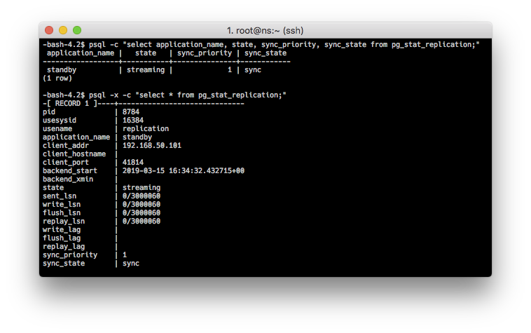
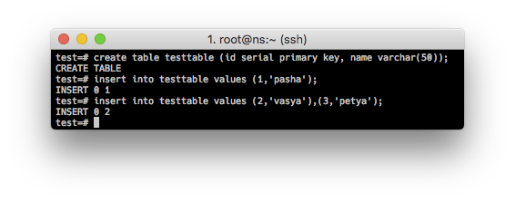

## PostgreSQL

- Настроить hot_standby репликацию с использованием слотов
- Настроить правильное резервное копирование

Для сдачи присылаем postgresql.conf, pg_hba.conf и recovery.conf
А так же конфиг barman, либо скрипт резервного копирования

### 1. primary

psql -c "CREATE USER replication REPLICATION LOGIN CONNECTION LIMIT 1 ENCRYPTED PASSWORD 'swimming3';"
createuser --replication -P replication
psql -c "ALTER ROLE replication CONNECTION LIMIT 5;"

### 1.1 pg_hba.conf

host	replication	replication	192.168.50.101/32	trust
host	replication	replication	192.168.50.100/32	trust

### 1.2 postgres.conf

listener_address = 192.168.50.100
wal_level = hot_standby
synchronous_commit = local
archive_mode = on
archive_command= 'cp %p /var/lib/pgsql/11/archive/%f'
max_wal_senders = 2
wal_keep_segments = 10
synchronous_standby_names = 'standby'

create archive dir

restart

### 2. standby

rm /var/lib/pgsql/11/data

pg_basebackup -h 192.168.50.100 -U replication -D /var/lib/pgsql/11/data -P --wal-method=stream

postgres.conf

listener_address = 192.168.50.101
hot_standby = on

recovery.conf

<pre>
standby_mode = on
primary_conninfo = 'host=192.168.50.100 port=5432 user=replication password=swimming3 application_name=standby'
trigger_file = '/tmp/postgresql.trigger.5432'
</pre>

### 3. check

primary

psql -c "select application_name, state, sync_priority, sync_state from pg_stat_replication;"
psql -x -c "select * from pg_stat_replication;"

create table testtable( id serial primary_key, name varchar(50);
insert into testtable values (2,'vasya'),(3,'petya');

standby

select * from testtable;

### 4. pg_basebackup

### 5. Ссылки

- https://blog.vpscheap.net/how-to-setup-replication-for-postgresql-in-centos-7/
- https://linuxhint.com/setup_postgresql_replication/
