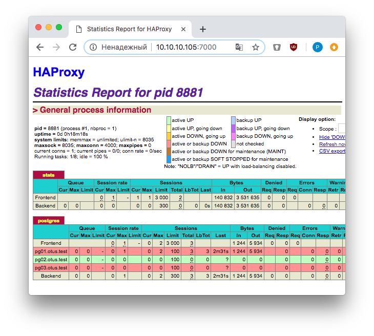

## PostgreSQL, patroni, cluster.

Задача:

- развернуть кластер PostgreSQL из трех нод. Создать тестовую базу -
проверить статус репликации;
- cделать switchover/failover;
- поменять конфигурацию PostgreSQL, также сделать это с параметром требущими
перезагрузки;
- настроить клиентские подключения через HAProxy.

Описание стенда:


### 0. Подготовка

Развертывание сервисов NTP, DNS, etcd, HAproxy.

Внесены небольшие поправки:

- записи A в файлах зон DNS сервера (pg01, pg02, pg03, ns);
- pg01-pg03 синхронизируется с ns по времени - изменение в конфиге chronyd;

Написаны [**ansible роли**](https://github.com/kakoka/otus-homework/tree/master/hw28/provision/roles) для всех компонентов стенда.

### 1. 


### 2.

### 3. Проверка работы репликации

**primary**

Вывод запросов к серверу о статусе репликации:

Подключимся к базе данных:

```bash
$ sudo -iu postgres
$ psql
```

Создаем базу данных и подключимся к ней:

```sql
postgres=# create database test;
postgres=# \c test
```

Создадим таблицу testtable и добавим в нее данные:

```sql
test=# create table testtable( id serial primary_key, name varchar(50);
test=# insert into testtable values (1,'pasha');
test=# insert into testtable values (2,'vasya'),(3,'petya');
```

**standby**

Подключимся к базе данных и сделаем запрос на выборку:

```bash
$ sudo -iu postgres
$ psql
postgres=# \c test
postgres=# select * from testtable;
```



### 5. Использование стенда

После клонирования репозитория:

<pre>
$ vagrant up
$ vagrant ssh pg01
</pre>

Через провижн при старте ВМ выполнится полный бэкап primary, при вводе вышеприведенных команд должен произойти инкрементальный бэкап.

Командной `sudo -iu postgres pgbackrest info` можно посмотреть статус репозитория, какие резеврные копии он содержит.

### 6. Ссылки
